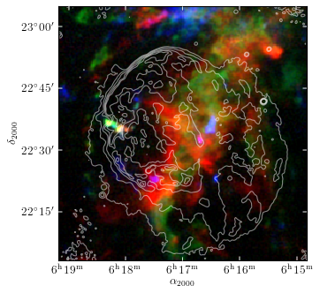
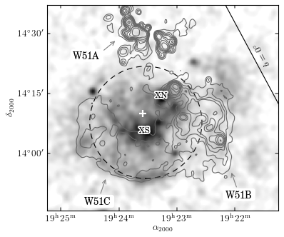
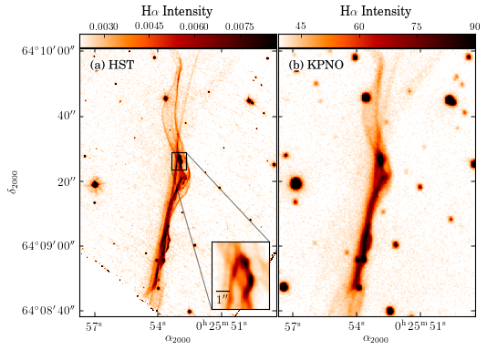
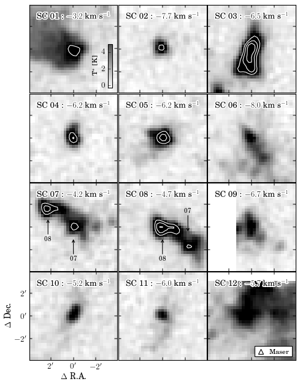

.. Matplotlib Gallery For Astronomy documentation master file, created by
   sphinx-quickstart on Sun Dec  6 17:11:11 2009.
   You can adapt this file completely to your liking, but it should at least
   contain the root `toctree` directive.

JJ's Matplotlib Gallery For Astronomy
=====================================

* IC443 Radio Continuum

.. image:: images/figure_ic443_radio_continuum.png
   :target: ic443/ic443.html

* IC443 CO RGB Composite

* W51C Xray and Radio

* Tycho HST & KPNO

* IC443 CO Channel Map

.. image:: images/ic443_channel_map.png
   :target: ic443/ic443_channel_map.html

* IC443 CO Stamps

* IC443 CO PV Map

.. image:: images/ic443_pv_map.png
   :target: ic443/ic443_pv_map.html

* CfA Survey

.. image:: images/cfa_survey.png
   :target: cfasurvey/cfasurvey.html

* WHAM All Sky Map

.. image:: images/allsky.png
   :target: allsky/allsky.html

.. toctree::
   :maxdepth: 2

..   cfasurvey/cfasurvey.rst
